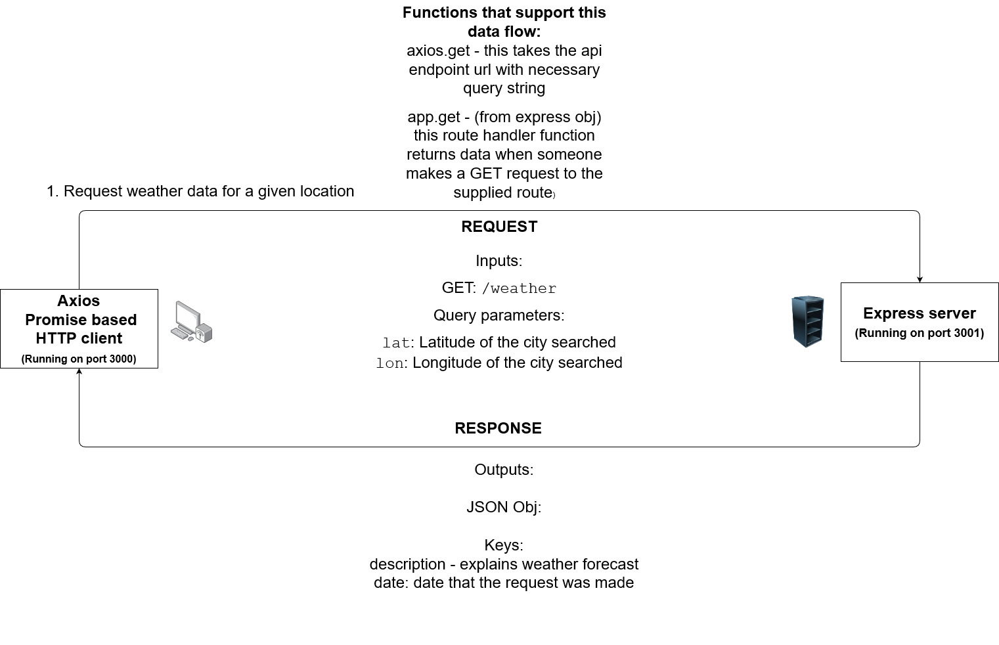

# City Explorer API

**Author**: Alexander Beers
**Version**: 1.2.0

## Overview
API server for the City explorer Application

## Getting Started
To run the frontend of this application please refer to the README for that portion of the application [here](https://github.com/Beers15/City-explorer/blob/main/README.md)

To run the backend of this application: Clone repo and install dependencies by running "npm i" command in the project's folder. Then run the "node index.js" command to start the API server.  

## Architecture
Node.js, express

## Change Log
08-23-2021 12:40pm - Initialize application with necessary packages and files.

08-23-2021 4:00pm - Create /weather API endpoint that takes longitude, latitude, and seach query data from a request and returns weather data if match is found in weather.json.

08-23-2021 5:40pm - Refactor /weather API. It now returns all forecasts for a given location that are in app's json data.

08-23-2021 6:15pm - Add error responses for failed /weather API calls. 

## Credit and Collaborations
N/A

Name of feature: Allow user to see weather info on entered city in a styled component

Estimate of time needed to complete: 1hr 30m

Start time: 3:00

Finish time: 4:40

Actual time needed to complete: 1hr 30m

Name of feature: Display detailed errors to user if anything goes wrong, style application

Estimate of time needed to complete: 30m

Start time: 4:45

Finish time: 6:15

Actual time needed to complete: 1hr 30m 
