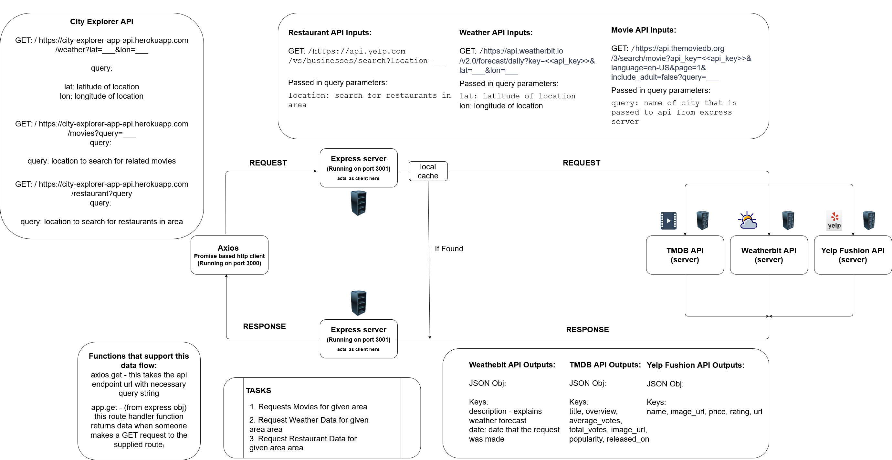

# City Explorer API

### Netlify link: This app can be found [here](https://nervous-mclean-43f026.netlify.app/)

**Author**: Alexander Beers
**Version**: 1.3.2

## Overview
API server for the City explorer Application

## Getting Started
To run the frontend of this application please refer to the README for that portion of the application [here](https://github.com/Beers15/City-explorer/blob/main/README.md)

To run the backend of this application: Clone repo and install dependencies by running "npm i" command in the project's folder. Then run the "node index.js" command to start the API server.  

## Architecture

Node.js, express, [TMDB Movie API](https://developers.themoviedb.org/3/getting-started/introduction), [weatherbit.io](https://www.weatherbit.io/)

## Change Log
08-23-2021 12:40pm - Initialize application with necessary packages and files.

08-23-2021 4:00pm - Create GET /weather route handler that takes longitude, latitude, and seach query data from a request and returns weather data if match is found in weather.json.

08-23-2021 5:40pm - Refactor GET /weather route handler. It now returns all forecasts for a given location that are in app's json data.

08-23-2021 6:15pm - Add error responses for failed GET /weather route requests.

08-25-2021 3:00pm - Refactor GET /weather route handler to use weatherbit.io's weather API instead of grab data from a local json file.

08-25-2021 4:45pm - Add GET /movies route handler that grabs movie data from request location and response with movie info. This api uses TMDB's movie API.

08-25-2021 5:15pm - Finish fixing issues involving responding with error messages to client upon unsuccessful calls to API endpoint.

08-26-2021 1:00pm - Seperate movies and weather fetching logic into their own modules.

## Credit and Collaborations
N/A

----------

### Name of feature: Allow user to see weather info on entered city

Estimate of time needed to complete: 1hr 30m

Start time: 3:00

Finish time: 4:40

Actual time needed to complete: 1hr 30m

### Name of feature: Errors - Display detailed errors to user if anything goes wrong, style application

Estimate of time needed to complete: 30m

Start time: 4:45

Finish time: 6:15

Actual time needed to complete: 1hr 30m

### Name of feature: Movies - Get movies related to the entered city.

Estimate of time needed to complete: 3hr

Start time: 1:45

Finish time: 5:15

Actual time needed to complete: 3hrs 30m

### Name of feature: Componentize the front-end codebase modules.

Estimate of time needed to complete: 1hr

Start time: 12:45

Finish time: 12:40

Actual time needed to complete: 55m

### Name of feature: Add a local cache to the app to avoid unnecessary API calls query is cached and recent enough

Estimate of time needed to complete: 1hr 30m

Start time: 2:30

Finish time: 3:45

Actual time needed to complete: 1hr 15m
